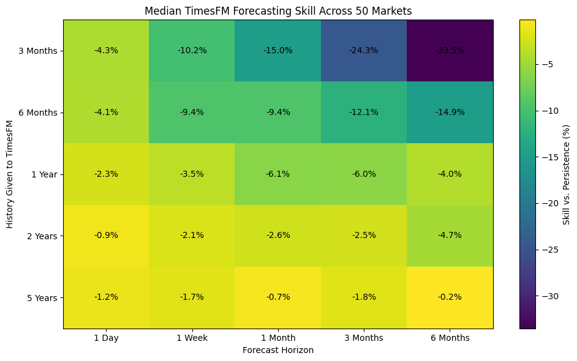
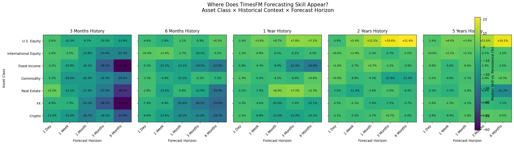

# TimesFM-3 vs. the Market

A reproducible evaluation of **zero-shot TimesFM-3 financial forecasting** across a diverse set of 50 markets.

The motivating question is simple: **does a pretrained time-series foundation model provide generalizable forecasting skill in financial prices, or can a trivial persistence forecast still beat it?**

[Open the working notebook in Colab](https://colab.research.google.com/drive/1Gfvy7S7EwWCE5pf_qFW-ERohskC1MZTu)

## Headline result

The initial S&P 500 experiment looked promising. The broader replication did not.

Across **50 heterogeneous financial markets**, **42 historical forecast origins**, **5 lookback windows**, and **5 forecast horizons**, the experiment produced **52,500 scored forecasts**. For the median asset, zero-shot TimesFM-3 failed to beat a persistence baseline in every lookback × horizon combination tested. Directional performance also failed to outperform simple asset-specific directional baselines.

Some configurations—especially U.S. equities with longer historical context and medium-to-long forecast horizons—looked promising descriptively. But after a one-sided Wilcoxon signed-rank screen and Benjamini–Hochberg false-discovery-rate correction across the tested asset-class × lookback × horizon cells, **no positive effect remained statistically significant**.

The result is therefore a negative one, but an informative one: **a striking result on a single financial series did not generalize once the evaluation was widened.**



## What is being evaluated?

TimesFM-3 is evaluated **zero-shot**: the pretrained model is used without financial fine-tuning. The primary benchmark is a persistence forecast, which predicts that the future price will equal the most recently observed price.

The main normalized metric is forecasting skill relative to persistence:

```text
Skill = 1 - (TimesFM MAE / Persistence MAE)
```

Positive skill means TimesFM reduced forecast error relative to persistence; negative skill means persistence was better.

The notebook also evaluates directional accuracy against an asset-specific naive directional baseline rather than against an arbitrary 50% threshold.

## Experimental design

The broad replication spans seven market categories:

- U.S. equities
- International equities
- Fixed income
- Commodities
- Foreign exchange
- Crypto
- Real estate

Five historical context lengths are crossed with five forecast horizons, producing **25 configurations per asset**:

| Historical contexts | Forecast horizons |
| --- | --- |
| 3 months | 1 day |
| 6 months | 1 week |
| 1 year | 1 month |
| 2 years | 3 months |
| 5 years | 6 months |

Every historical-context setting is evaluated at every forecast horizon.

All 50 assets are aligned to a common complete-market observation calendar, and the same historical origins are used across the broad replication. Missing observations are not forward-filled.



## Statistical screen

The notebook treats the asset-class patterns as exploratory. For each asset class × lookback × forecast-horizon cell, a **one-sided Wilcoxon signed-rank test** asks whether asset-level forecasting skill is systematically positive. The resulting p-values are then corrected using **Benjamini–Hochberg FDR** across all testable cells.

There were nominally positive cells before correction, but none survived FDR correction. The apparent U.S.-equity ridge is therefore treated as a hypothesis for future confirmatory work rather than an established forecasting advantage.


## Important limitations

This is an exploratory evaluation, not evidence of an investable trading strategy. In particular:

- Historical replay may overlap with data that could have appeared during model pretraining, so it is not a clean prospective out-of-sample test of model knowledge.
- Forecast origins are temporally dependent, especially at longer horizons where target windows overlap.
- Assets within classes are correlated; nine U.S. equity ETFs are not nine independent replications.
- The Wilcoxon/FDR analysis is therefore an exploratory screen rather than the final word on inference. A stronger confirmatory design would use dependence-aware methods such as block bootstrapping and modified Diebold–Mariano tests for paired forecast comparisons.
- Forecasting skill is not the same thing as economic or trading value.

## Why this repo exists

The methodological lesson is at least as important as the model result. The notebook begins with a compelling result on SPY, then progressively expands the evaluation until that apparent advantage largely disappears.

The evaluation sequence is intentionally visible:

**interesting result → probe the metric → vary context and horizon → broaden the sample → test alternative explanations → apply a significance screen → weaken the claim when the evidence weakens**

That is the behavior this project is intended to make reproducible.

## Next question

Weak zero-shot transfer does not imply that TimesFM cannot acquire useful financial structure through adaptation. A separate follow-up experiment will test whether fine-tuning changes that result:

> **How much does targeted fine-tuning improve the pretrained model, and do the benefits of fine-tuning differ across asset classes and time-series structures?**

That is deliberately outside the scope of this notebook.

## Repository structure

```text
timesfm-finance-eval/
├── README.md
├── notebooks/
│   └── 01_timesfm_zero_shot_finance.ipynb
├── figures/
│   ├── aggregate_skill.png
│   ├── class_horizon_lookback.png
│   └── significance_screen.png
├── requirements.txt
└── LICENSE
```

## Reproducing the notebook

A CPU-only run is possible, but the 50-asset replication is computationally nontrivial. In the saved Colab run, the main 210-batch replication took roughly 55 minutes on a two-core CPU runtime.

Install dependencies with:

```bash
pip install -r requirements.txt
```

Then run `notebooks/01_timesfm_zero_shot_finance.ipynb` from top to bottom. The published notebook retains its saved outputs so the empirical results can be inspected without rerunning the full inference job.

## License

Code in this repository is released under the MIT License.
